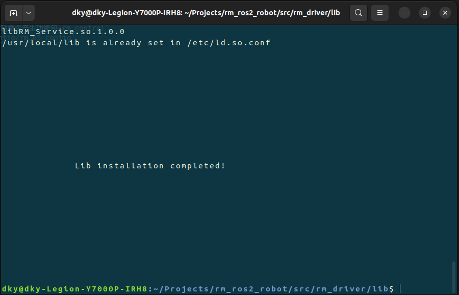
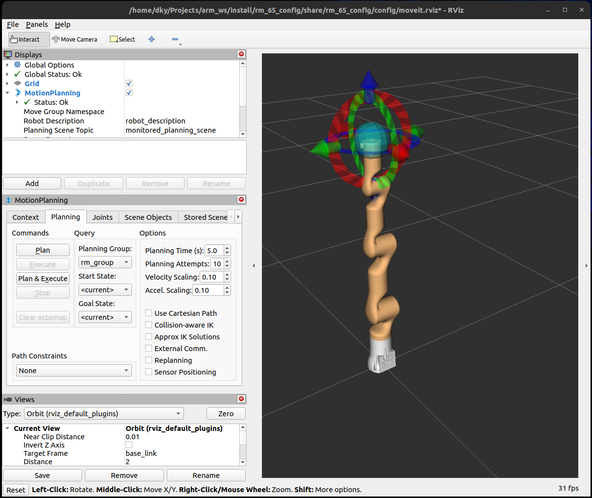
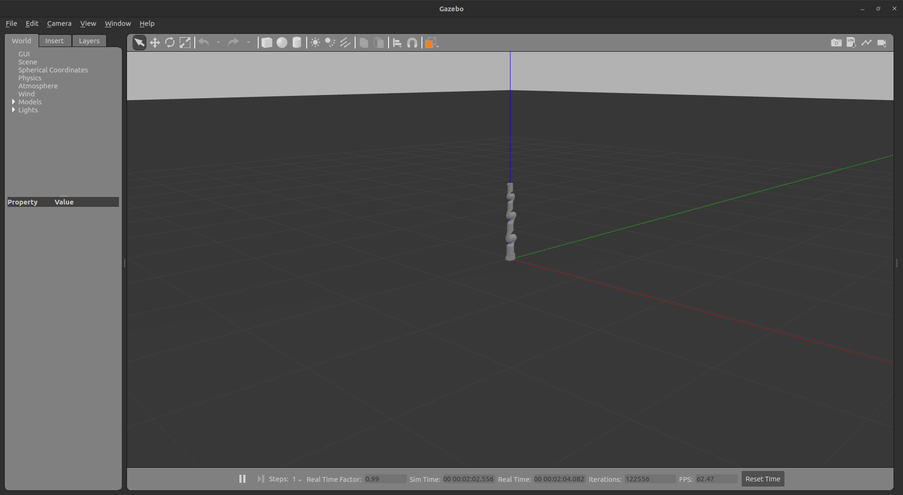
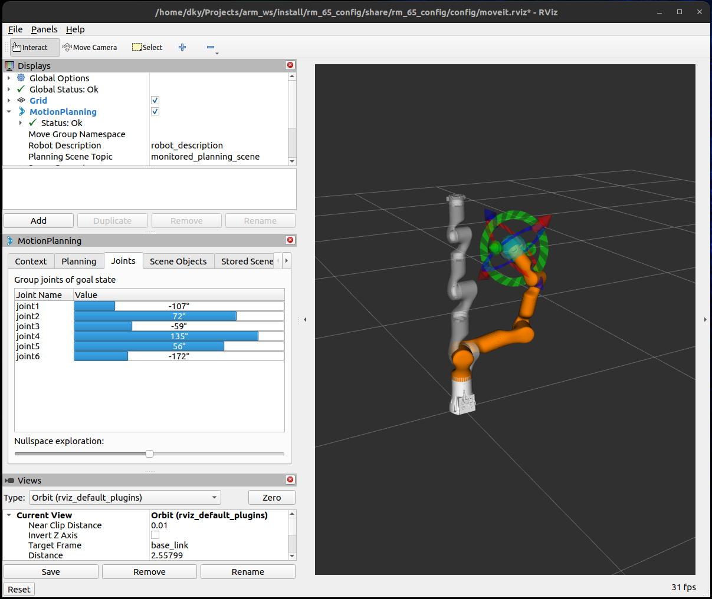
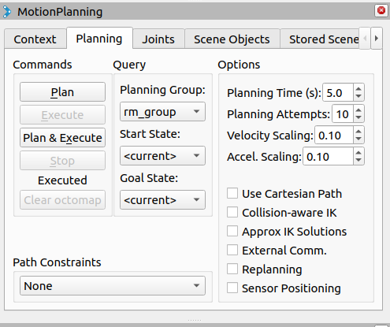
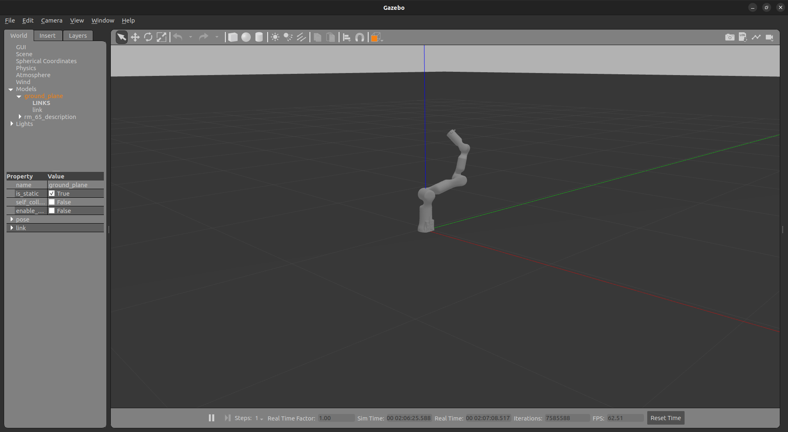
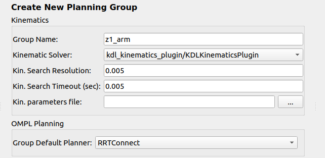

<div align="center">

# 机械臂仿真及真机使用说明书V1.0

</div>

## 工程架构
本工程启动功能包为`rm_bringup`, 其中`rm_65_gazebo.launch.py` 和`rm_65_bringup.launch.py`分别为睿尔曼RM65机械臂的仿真启动文件和真机控制文件。

`rm_65_gazebo.launch.py`启动了两个节点
 * 启动gazebo仿真环境`rm_gazebo`
 * 加载moveit2运动规划工具和启动rviz2可视化界面，`rm_moveit2_config/rm_65_config`

`rm_65_bringup.launch.py`启动了四个节点
* 与真实机械臂网络连接并发送控制命令功能包`rm_driver`
* 机械臂描述功能包`rm_description`
* 针对真实机械臂设计的三次样条插值，使轨迹更平滑且便于执行的机械臂控制命令产生功能包`rm_control`
* 加载moveit2运动规划工具和启动rviz2可视化界面，`rm_moveit2_config/rm_65_config`

## 使用说明
仿真运行命令
```[language=bash]
colcon build
source install setup.bash
ros2 launch rm_65_gazebo.launch.py
```
真机命令
连接并配置(ip)机械臂后运行命令
```[language=bash]
colcon build
source install setup.bash
ros2 launch rm_65_bringup.launch.py
```
若报警告或错误，运行命令
```[language=bash]
cd src/rm_driver/lib
sudo bash lib_install.sh
```
当出现如下页面时，返回工作空间目录重新运行对应launch文件

`lib_install.sh`为压缩包，也是睿尔曼不开源部分(没法抄)。`rm_driver`功能包调用的主要就是这个API库。

## 仿真说明
当运行`rm_65_gazebo.launch.py`时，出现rviz2和gazebo页面


调节rviz2中末端执行器位姿，如图所示

点击`Plan & Execute`, gazebo中将会显示机械臂运动状态
<div align="center">

</div>



若要修改运动学求解器，需在`moveit_setup_assistant`中修改Kinematiic Solver; 若要修改默认规划器组，需修改Group Default Planner，一般情况下默认规划器组为RRTConnect，由图所示，moveit2中的运动规划算法都是开源OMPL算法，睿尔曼机械臂所用也是如此。
<div align="center">

</div>

## 真机控制
暂无

## 附
宇树z1机械臂的仿真及正逆运动学见[Unitree_Z1_Control](https://github.com/Ding-Kaiyue/Unitree_Z1_Control.git)
